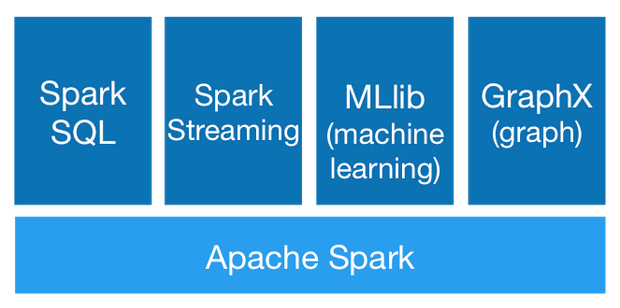
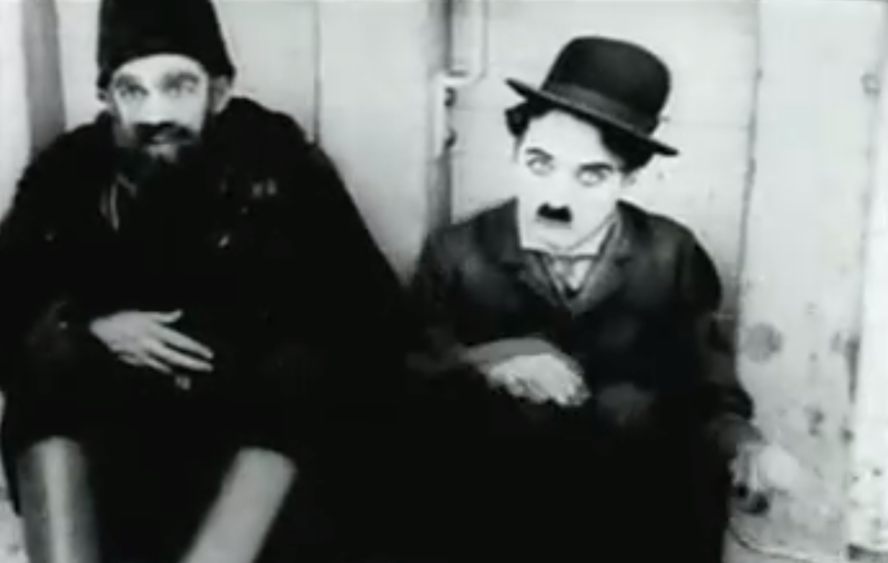
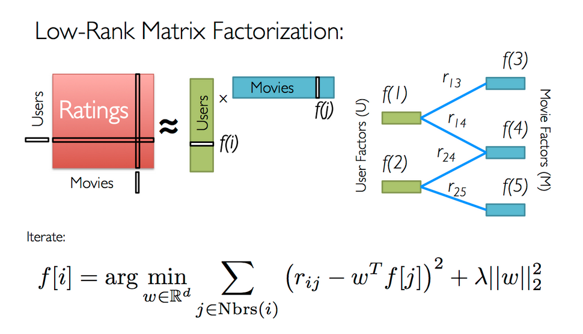

<script src="http://ajax.googleapis.com/ajax/libs/jquery/1.9.1/jquery.min.js"></script>

## Mining Big Data with Apache Spark


<small>Ales Kotnik</small>

<small>Toptal</small>

---

## What is Apache Spark?

> Is a fast and general engine for large-scale data processing.

--- .incremental

## Data Mining Workflow 

> * Get sample data set

> * Clean data

> * Explore data

> * Build model

> * Scale model

> * Apply model in realtime

--- 

## Spark History [*](https://www.youtube.com/watch?v=FjhRkfAuU7I&t=8m4s)

> * 2009 UC Berkley Matei Zaharia (toy project with 600 LOC)
  
> * 2010 Opensourced

> * 2013 Donated to Apache Software Foundation

> * 2014 First stable release 1.0

---

## Project philosophy

> * Well documented expressive API

> * Powerful domain specific libraries

> * Easy integration with storage systems (Hadoop htfs, Cassandra,  H base)

> * Regular maintenance releases

--- 

## Benefits

> * Fast (up to 100x faster than Hadoop)

> * Fault tolerant

> * Supports variety of languages (Java, Scala, Python, R)

---

## Advanced DSL libraries



---

## Core Concepts

> * RDD (Resilient Distributed Dataset)

> * collection of immutable records partitioned accross the cluster

> * Transformations (map, filter, groupBy, sort, ...)

> * Actions (count, collect, save, ...)

---

## Big Data Hello World

Word counting

```scala
val textFile = spark.textFile("~/Documents/shakespeare.txt")

val counts = textFile.flatMap(line => line.toLowerCase.split("[^a-z]"))
                 .map(word => (word, 1))
                 .reduceByKey((acc, count) => acc + count)
                 
counts.saveAsTextFile("~/Documents/shakepseare-word-count")
```

---

## Demo Time



---

## Collaborative filtering

Say Alice likes  Batman and  Bob likes  Batman. If Alice also likes Birdman it is more probable that Bob to also likes Birdman than a randomly chosen user.

---

## Movie recommendation 

> * Collaborative filtering

> * Factorizing large sparse matrix of users ratings

> * Dimensions: $u$ (# of users) rows and $m$ columns (# of movies)

> * $A_{u \times m} \approx U_{u \times k} \times M_{m \times k}^T$

> * $k$ hidden factors in user matrix represent a user's taste

> * Explicit matrix factorization

---

## The Alternating least squares

.fragment 

<small>(Credits: [Apache Spark Tutorial](https://databricks-training.s3.amazonaws.com/movie-recommendation-with-mllib.html))</small>

---

## Example application

Source code only notebook with demo application:

[https://github.com/alesk/spark-talk-2015](https://github.com/alesk/spark-talk-2015)

Rendered notebook (cells with resulting output):

[http://alesk.github.io/spark-talk-2015/movie-recommendation.pdf](http://alesk.github.io/spark-talk-2015/movie-recommendation.pdf)

---

--

## The next steps

.fragment Complete some Massive Open Online Course (MOOC):

> * Edx.org: [Introduction to Big Data with Apache Spark](https://www.edx.org/course/introduction-big-data-apache-spark-uc-berkeleyx-cs100-1x)

> * Edx.org: [Scalable Machine Learning](https://www.edx.org/course/scalable-machine-learning-uc-berkeleyx-cs190-1x)

> * Coursera: [Unlock Value in Massive Datasets](https://www.coursera.org/specializations/big-data)

---
## Questions 


<script>
$('ul.incremental li').addClass('fragment')
$('ol.incremental li').addClass('fragment')
</script>


